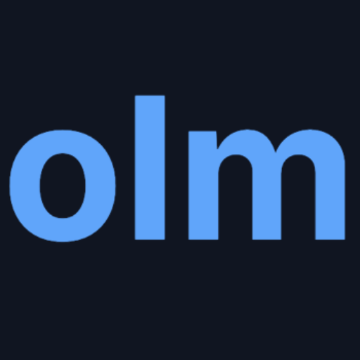

# olm OCR - 智能文档识别系统 | Intelligent Document Recognition System

[English](#english) | [中文](#中文)

  

  <h3 align="center">olm OCR</h3>

  

    新一代智能文档识别系统，让文档数字化更简单
     
    Next-generation document recognition system, making digitization simpler
     
    <a href="https://olmocr.im"><strong>立即使用 Try Now »</strong></a>
  

## 中文

### 项目简介

olm OCR 是一款革新性的开源文档识别系统，采用最新的深度学习技术，为用户提供专业级的文字识别服务。从简单的文本到复杂的表格、数学公式，再到多语言混排文档，olm OCR 都能以极高的准确率完成识别任务，并完整保留原始格式。

### 核心特点

- 🚀 **开源透明**：代码完全开源，社区驱动发展，可自由使用和定制
- 🎯 **精准识别**：基于深度学习的智能识别技术，准确率业界领先
- 📊 **智能表格**：自动识别表格结构，完整还原单元格关系
- 🌏 **语言支持**：支持全球超过100种语言识别，中英文识别效果尤其出色
- 📝 **格式保持**：智能分析文档结构，保留标题、段落、列表等原始排版
- 🔒 **数据安全**：本地运算处理，无需担心敏感数据泄露

### 快速开始

1. 访问 [olmocr.im](https://olmocr.im)
2. 上传需要识别的文档
3. 等待识别完成
4. 下载识别结果

### 技术文档

详细的技术文档和 API 说明请访问：[olmocr.im/docs](https://olmocr.im/docs)

## English

### Introduction

olm OCR is an innovative open-source document recognition system that employs cutting-edge deep learning technology to provide professional-grade text recognition services. From simple text to complex tables and mathematical formulas, to multilingual documents, olm OCR can complete recognition tasks with high accuracy while fully preserving the original format.

### Key Features

- 🚀 **Open Source**: Fully open source, community-driven development
- 🎯 **High Precision**: Advanced AI-powered recognition technology
- 📊 **Smart Tables**: Automatic table structure recognition
- 🌏 **Multilingual**: Support for 100+ languages worldwide
- 📝 **Format Retention**: Preserves original document layout
- 🔒 **Privacy First**: All processing happens locally

### Quick Start

1. Visit [olmocr.im](https://olmocr.im)
2. Upload your document
3. Wait for processing
4. Download results

### Documentation

For detailed technical documentation and API references, visit: [olmocr.im/docs](https://olmocr.im/docs)

## License

This project is licensed under the MIT License - see the [LICENSE](LICENSE) file for details.

## Links

- Website: [olmocr.im](https://olmocr.im)
- Documentation: [olmocr.im/docs](https://olmocr.im/docs)
- Issue tracker: [GitHub Issues](https://github.com/yourusername/olmocr/issues)

---

Made with ❤️ by the olm OCR team

